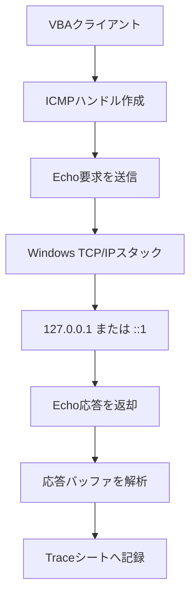

# VBA IcmpAPI Ping Sample

WindowsのICMP APIをExcel VBAから直接呼び出し、IPv4／IPv6のPing処理を学ぶための日本語サンプルです。

`ping.exe`、`WScript.Shell`、PowerShellは使用しません。APIハンドルの作成、ICMP Echo要求、応答バッファの解析、ハンドルの解放までを、コメントとトレースで順に確認できます。

> [!IMPORTANT]
> ソースコードとAPI構造は静的レビュー済みですが、このリポジトリを作成した環境にはWindows版Excelがないため、Excel実機での動作確認は未実施です。最初は必ず`127.0.0.1`または`::1`で確認してください。

## 学べること

- `IcmpCreateFile`／`IcmpSendEcho`／`IcmpCloseHandle`によるIPv4 Ping
- `Icmp6CreateFile`／`Icmp6SendEcho2`による`::1`宛てIPv6 Ping
- `LongPtr`を使ったVBA7の32bit／64bit Office対応
- APIへバイト配列の先頭ポインターを渡す方法
- `ICMP_ECHO_REPLY`／`ICMPV6_ECHO_REPLY`の必要部分を読む方法
- APIエラーとIPステータスの違い
- TraceIdで送信と応答を結び付ける方法
- エラー時にもハンドルを閉じる後始末

## 処理の全体像

このサンプルの「相手側」は、別のVBA製サーバーではなく、Windows自身のTCP/IPスタックです。ICMP Echo応答はOSが処理するため、学習用サーバーを別途起動する必要はありません。

## ファイル構成

| ファイル | 役割 |
|---|---|
| `src/TraceLogger.bas` | イミディエイトウィンドウとTraceシートへの共通ログ出力 |
| `src/IcmpPingIPv4.bas` | IPv4 Ping本体。既定値は`127.0.0.1`へ4回 |
| `src/IcmpPingIPv6Loopback.bas` | IPv6の`::1`だけを対象とする最小教材 |
| `docs/TESTING.md` | Excelへの導入方法と確認ケース |
| `docs/REVIEW.md` | 10ペルソナ・100観点の静的レビュー記録 |
| `SECURITY.md` | 安全に試すための注意事項 |

## まず動かす

1. Windows版Excelで空のブックを作り、`.xlsm`形式で保存します。
2. `Alt`+`F11`でVBE（Visual Basic Editor）を開きます。
3. VBEの「ファイル」→「ファイルのインポート」で、`src`内の3つの`.bas`を読み込みます。
4. 「デバッグ」→「VBAProjectのコンパイル」を実行します。
5. `Alt`+`F8`から`RunPingLocalhost`を実行します。
6. Excelへ自動作成された`Trace`シートを確認します。
7. IPv6も確認する場合は`RunPingIPv6Loopback`を実行します。

VBEで`Ctrl`+`G`を押すと、同じトレースをイミディエイトウィンドウでも確認できます。

### 日本語コメントが文字化けした場合

GitHub上のソースはUTF-8です。VBEの`.bas`インポートが日本語を正しく扱わない環境では、UTF-8対応エディターでCP932（Shift_JIS）へ変換してから読み込むか、VBEの新規モジュールへコードを貼り付けてください。日本語の文字列リテラルもあるため、コンパイル前に表示を確認します。

## Traceシート

| 列 | 意味 | 例 |
|---|---|---|
| `Time` | 記録時刻 | `21:10:01.125` |
| `TraceId` | 1回の処理を関連付けるID | `PING4-...-01` |
| `Side` | 処理主体 | `CLIENT`／`TARGET` |
| `Step` | 処理段階 | `SEND_ECHO`／`RECEIVE_REPLY` |
| `Direction` | データの向き | `OUT`／`IN`／`LOCAL` |
| `Detail` | 宛先、バイト数、RTT等 | `From=127.0.0.1, RTT=0ms` |
| `Result` | 結果またはIPステータス | `IP_SUCCESS` |
| `ElapsedMs` | 処理開始からの経過時間 | `2` |

## IPv4とIPv6で範囲が違う理由

IPv4版は、`127.0.0.1`のほか、利用者が明示したドット区切りIPv4アドレスを`PingIPv4`へ渡せます。

IPv6版は、次の話題を同時に持ち込まずICMPv6 APIへ集中できるよう、`::1`専用です。

- DNSによる名前解決
- リンクローカルアドレスのスコープID
- 複数NICからの送信元選択
- IPv6文字列の省略表記の解析

外部IPv6宛てへ拡張する場合は、`GetAddrInfoW`等で`SOCKADDR_IN6`を作る設計が必要です。

## 制限事項

- Windows版Excel／VBA7専用です。macOS版ExcelではWindows APIを呼べません。
- `IcmpSendEcho`は同期APIです。各要求は応答またはタイムアウトまで待ちます。
- `DoEvents`は要求間でExcelへ制御を戻しますが、API待機中を非同期化するものではありません。
- ホスト名の名前解決は行わず、IPv4版はドット区切りアドレスだけを受け付けます。
- 複数NIC環境の送信元を指定しません。Windowsの経路選択に任せます。
- IPv4入力は構文を検証しますが、ユニキャストだけへ限定していません。初回は必ず`127.0.0.1`を使います。
- Firewallや端末ポリシーによりICMP応答が遮断される場合があります。

## 公式資料

- [IcmpSendEcho function](https://learn.microsoft.com/windows/win32/api/icmpapi/nf-icmpapi-icmpsendecho)
- [ICMP_ECHO_REPLY structure](https://learn.microsoft.com/windows/win32/api/ipexport/ns-ipexport-icmp_echo_reply)
- [ICMP_ECHO_REPLY32 structure](https://learn.microsoft.com/windows/win32/api/ipexport/ns-ipexport-icmp_echo_reply32)
- [Icmp6SendEcho2 function](https://learn.microsoft.com/windows/win32/api/icmpapi/nf-icmpapi-icmp6sendecho2)
- [ICMPV6_ECHO_REPLY structure](https://learn.microsoft.com/windows/win32/api/ipexport/ns-ipexport-icmpv6_echo_reply_lh)
- [IP Helper API](https://learn.microsoft.com/windows/win32/api/_iphlp/)

## papanda925のネットワーク学習シリーズ

本リポジトリは、Excel VBAからWindowsのネットワーク機能を学ぶ教材シリーズの一つです。Pingの次はTracerouteへ進むと、到達性の確認から経路の観察へ理解を広げられます。HTTP、DNS、IPv6 TCP/UDPのサンプルも公開しています。

シリーズの一覧と推奨学習順序は、[papanda925 GitHubプロフィール](https://github.com/papanda925)を参照してください。技術記事は[papanda925.com](https://papanda925.com/)で公開しています。

## ライセンス

この教材は[MIT License](LICENSE)で公開しています。学習、授業、社内研修、改変、再配布に利用できます。再利用する場合は、著作権表示とライセンス文を残してください。ソフトウェアは無保証です。
